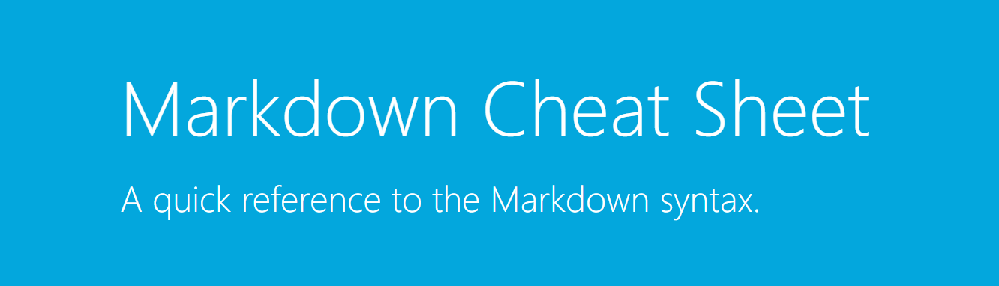

# Taller 3: Introducción a Markdown

## Sintaxis básica

Este es un ejemplo que incluye **palabras en negrita**, *palabras en cursiva* y `código` dentro del mismo párrafo.

```json
{
  "primerNombre": "Mariana",
  "apellido": "Quiroz",
  "age": 19
}
```

1. Primer elemento de una lista ordenada
2. Segundo elemento de una lista ordenada
3. Tercer elemento de una lista ordenada

- Primer elemento de una lista desordenada
- Segundo elemento de una lista desordenada
- Tercer elemento de una lista desordenada

[Un enlace a una URL externa](https://www.markdownguide.org/)
[Un enlace a otro fichero Markdown](README.md)



| Sintaxis de Tabla | Descripción |
| ----------- | ----------- |
| Encabezado | Título |
| Párrafo | Texto |